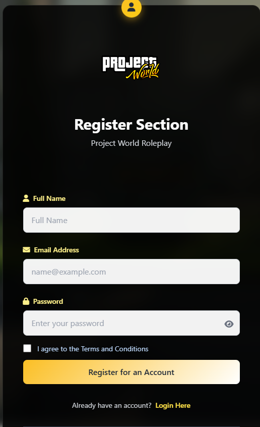
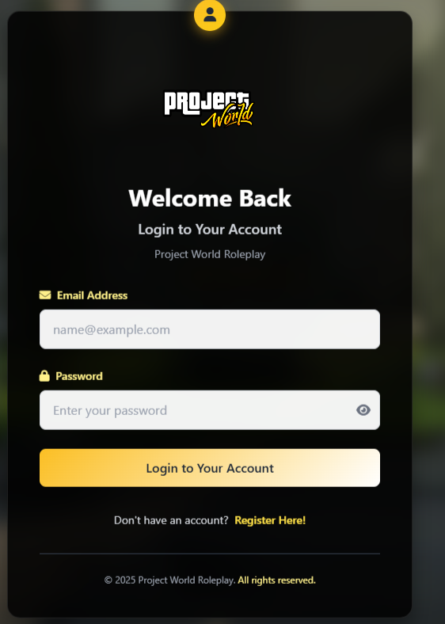
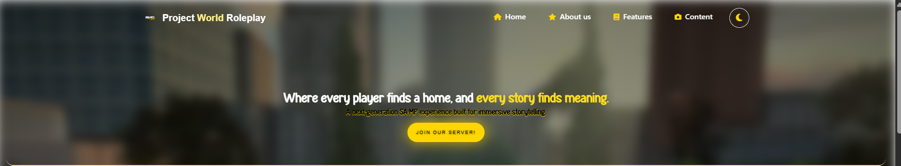
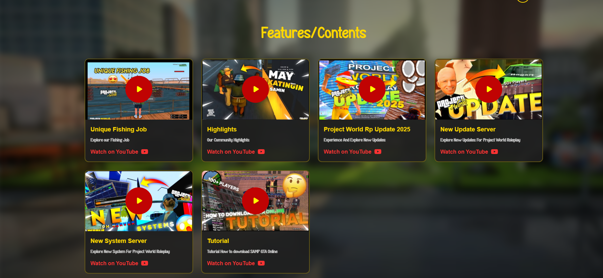
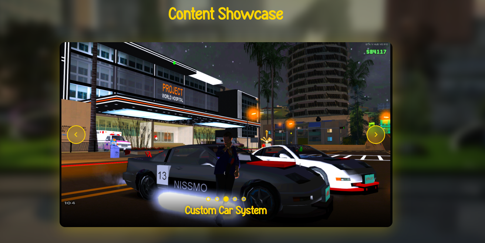
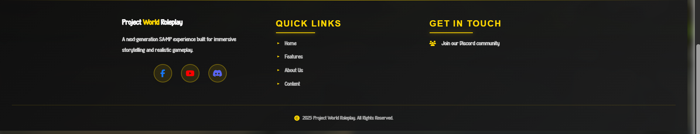
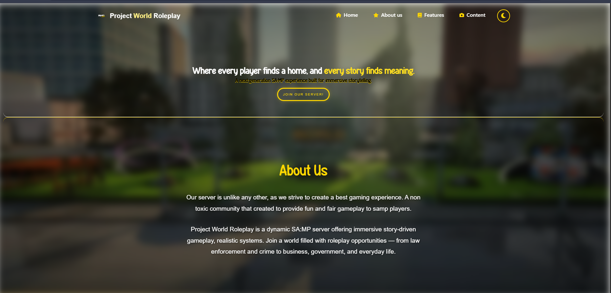
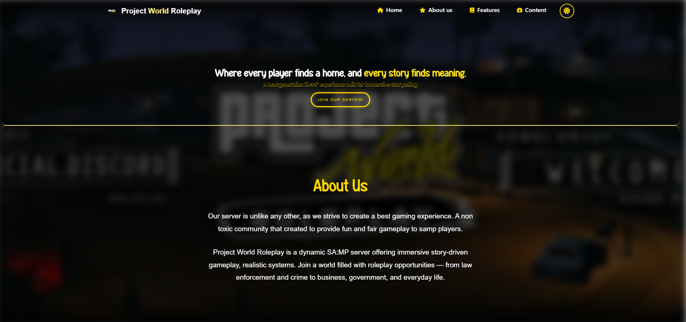

# Project World Roleplay

## Features
- User Register/Login Form

## Navigation Menu
* Responsive Navigation Menu
* Easy to access to website sections
* Clean and organized layout

## Dark Mode
* Toggle between light mode and dark mode
* Improved user experience and accessibility
* Modern interface design

## Content Showcase
* Display featured content in card layouts
* Organized presentation of information
* Responsive design for desktop and mobile devices

## Youtube Integration
* Direct links to YouTube videos
* Showcase trailers, tutorials, or promotional content
* Quick access to multimedia resources

## Responsive Design
* Optimized for desktop, tablet, and mobile devices
* Flexible layouts and smooth navigation

## Register Section

## Login Section

## Home Section

## About Section

## Content Section

# Showcase Section

# Footer Section

# Light Mode

# Dark Mode

## Link Website
https://projectworldroleplay.infinityfreeapp.com/index.php#

## Dev - Niks

<!-- ----------------------------- End Here -----------------------------  -->
